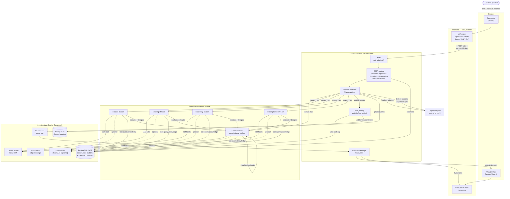

# Mycelium OS

A constitutional framework for AI-native organisations. Shrooms are the employees.

The platform governs how they communicate, escalate, evolve — and makes it visible through a real-time visual office.

## Prerequisites

| Tool | Version | Install |
|---|---|---|
| Docker + Compose | v27+ / v2+ | [docker.com](https://docs.docker.com/get-docker/) |
| Node.js | v20+ | [nodejs.org](https://nodejs.org/) |
| pnpm | v9+ | `corepack enable` |
| Python | 3.11+ | [python.org](https://www.python.org/) |

## Quick start

```bash
# 1. Clone and enter
git clone https://github.com/HannesDS/mycelium-os.git
cd mycelium-os

# 2. Copy env file and set DEV_API_KEY
cp .env.example .env
# Edit .env: set DEV_API_KEY=your-dev-key and DEMO_ENABLED=true for local dev

# 3. Start infrastructure + control plane (must run before make dev)
make up

# 4. In a second terminal — start the frontend
make dev

# 5. Open the app
open http://localhost:3000
```

Or without make:

```bash
docker compose up -d            # infra + control plane (required before pnpm dev)
pnpm install                   # frontend deps
pnpm dev                       # Next.js dev server at :3000
```

If `curl http://localhost:8000/shrooms` fails with connection refused, run `make up` first.

## What's running

| Service | URL | Purpose |
|---|---|---|
| Frontend | http://localhost:3000 | Next.js visual office |
| Control Plane API | http://localhost:8000 | FastAPI — constitution, shrooms, events |
| API docs | http://localhost:8000/docs | Interactive OpenAPI explorer |
| PostgreSQL | localhost:5432 | Constitution, audit log, beads memory |
| Neo4j | http://localhost:7474 | Shroom topology graph |
| NATS | localhost:4222 | Event bus (Core NATS; JetStream deferred post-MVP) |
| MinIO | http://localhost:9001 | S3-compatible object storage |
| Mailhog | http://localhost:8025 | Dev email inbox |
| Ollama | localhost:11435 (default host port) | Local LLM runtime |

If `make up` fails with `bind: address already in use` on Ollama, set `OLLAMA_HOST_PORT` in `.env` to a free port and run `make up` again.

**Mistral model (docker compose):** The control plane uses Ollama inside the container. Pull the model into the container so it persists in the volume:

```bash
docker compose exec ollama ollama pull mistral
```

### Authentication (required)

Set `DEV_API_KEY` in `.env` (same value for control plane and frontend). The frontend proxy at `/api/control-plane/*` adds it server-side; the key never reaches the browser. See [docs/dev-flow/CONFIGURATION.md](docs/dev-flow/CONFIGURATION.md).

### OpenRouter (optional)

To use cloud models instead of local Ollama, set `OPENROUTER_API_KEY` in `.env` (get a key at [openrouter.ai/settings/keys](https://openrouter.ai/settings/keys)). In `mycelium.yaml`, set shroom models to `openrouter/<model-id>` (e.g. `openrouter/anthropic/claude-3.5-sonnet`). If the key is missing when an OpenRouter model is used, the API returns a clear error.

## Project structure

```
mycelium-os/
├── apps/
│   ├── frontend/          # Next.js + Konva canvas
│   └── control-plane/     # Python FastAPI
├── packages/
│   ├── shroom-events/     # Shared event type definitions
│   └── shroom-manifest/   # Manifest validation
├── examples/
│   └── shrooms/           # Example shroom YAML manifests
├── docs/
│   ├── adrs/              # Architecture Decision Records
│   ├── design/            # Specs and schemas
│   └── project-state/     # Backlog, open questions
├── chart/                 # Helm chart (future)
├── mycelium.yaml          # The constitution — source of truth
├── docker-compose.yml     # Full local stack
└── Makefile               # Dev task runner
```

## Common tasks

```bash
make up          # Start all services (docker compose up -d --build)
make down        # Stop all services
make dev         # Install deps + start frontend dev server
make test        # Run all tests (frontend + control plane)
make lint        # Lint frontend
make logs        # Tail docker compose logs
make migrate     # Run Alembic migrations
make clean       # Remove volumes and rebuild
make psql        # Open psql shell to local Postgres
```

## Architecture



Two planes — always kept separate:

**Control Plane** — immutable, signed, version-controlled
Constitution (`mycelium.yaml`), graph DB, escalation engine, audit log.

**Data Plane** — ephemeral, isolated, observable
Shroom sandboxes, tool execution, MCP connectors, object storage.

- [docs/design/ARCHITECTURE.md](docs/design/ARCHITECTURE.md) — detailed diagrams, concepts, tech stack
- [docs/dev-flow/CONFIGURATION.md](docs/dev-flow/CONFIGURATION.md) — env vars, API proxy
- [docs/adrs/](docs/adrs/) — locked architecture decisions

## Contributing

See [CONTRIBUTING.md](CONTRIBUTING.md).

## License

MIT
