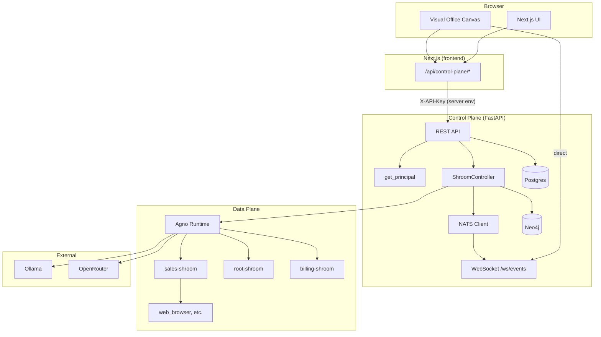
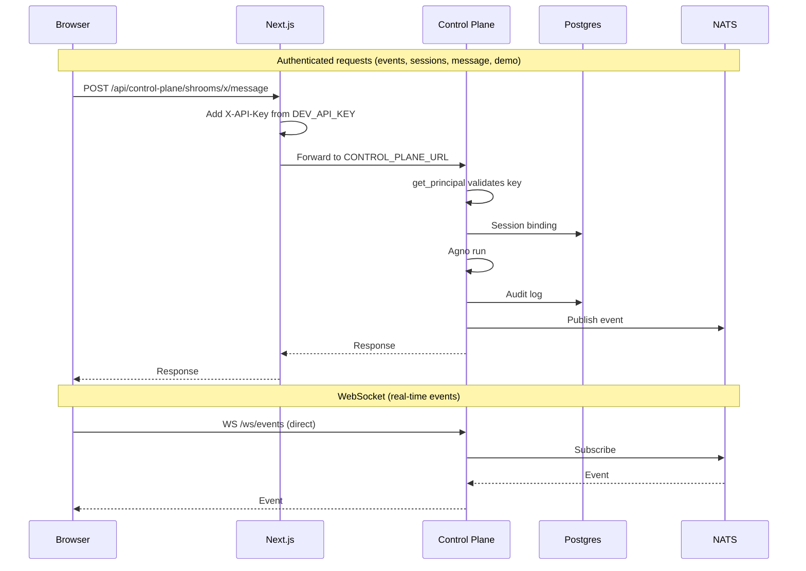
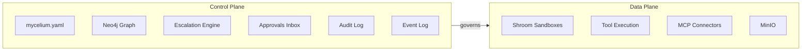
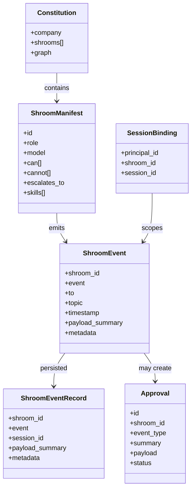
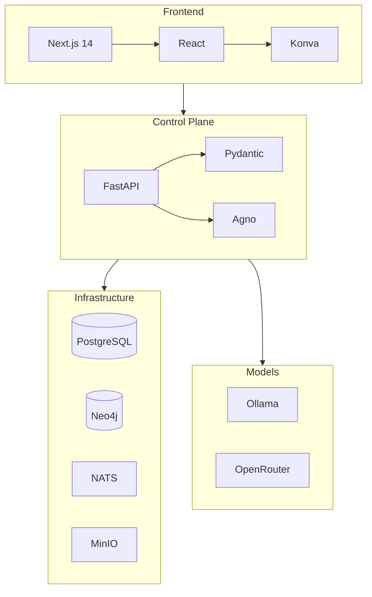
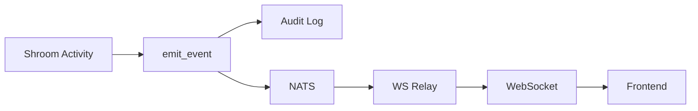
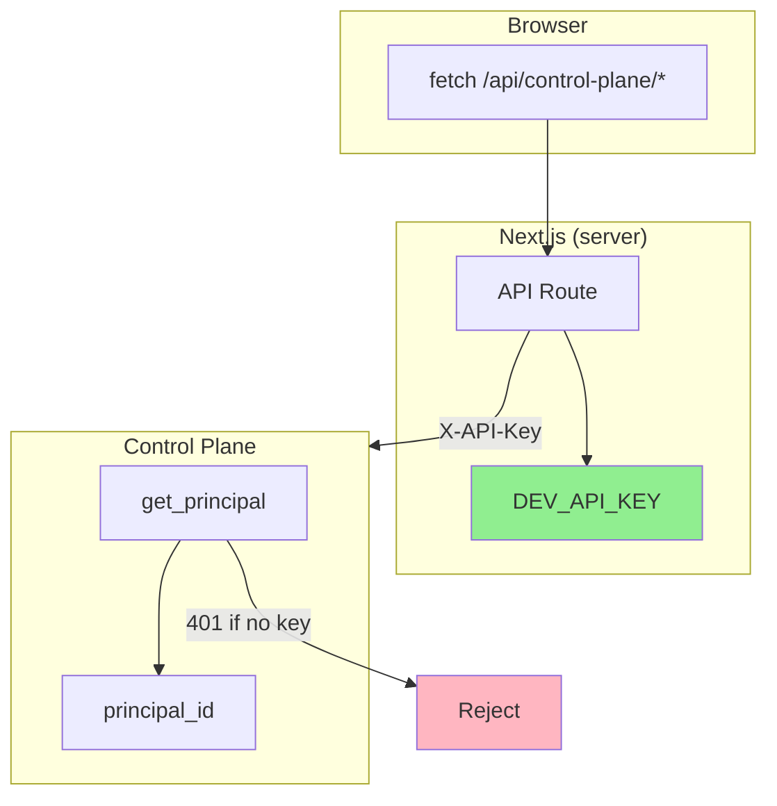

# Mycelium OS — Architecture

## System overview



## Request flow



## Two planes



## Core concepts



## Tech stack



## Event flow



## API routes

```mermaid
flowchart TB
    subgraph Public["Public (no auth)"]
        Shrooms[/shrooms]
        Shroom[/shrooms/:id]
        Constitution[/constitution]
        Skills[/skills]
        Org[/org/graph]
    end

    subgraph Protected["Protected (X-API-Key)"]
        Events[/events]
        Sessions[/sessions]
        Message[/shrooms/:id/message]
        Demo[/demo/trigger-escalation]
        Approvals[/approvals]
    end

    subgraph WebSocket["WebSocket"]
        WSEvents[/ws/events]
    end
```

## Security



**Key:** API key never leaves the server. `DEV_API_KEY` is server-only; `NEXT_PUBLIC_*` is never used for secrets.
